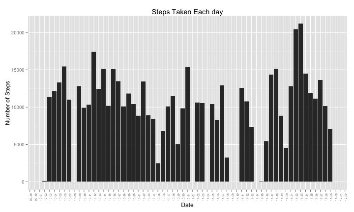
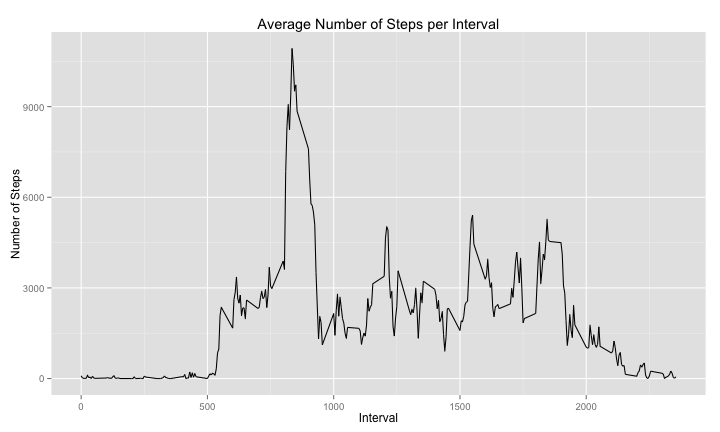
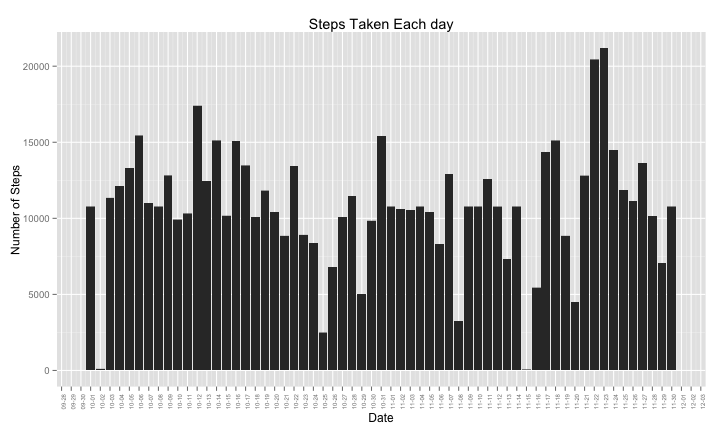
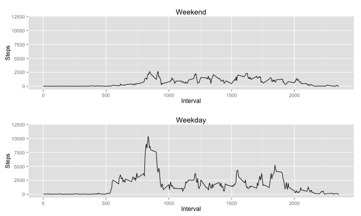

# Reproducible Research: Peer Assessment 1  
  
    
This assignment makes use of data from a personal activity monitoring device. This device collects data at 5 minute intervals through out the day. The data consists of two months of data from an anonymous individual collected during the months of October and November, 2012 and include the number of steps taken in 5 minute intervals each day.

## Loading and preprocessing the data


```r
# Load needed libraries and set global options

library(ggplot2)
library(scales)
library(plyr)
library(chron)
library(grid)
library(gridExtra)
options(scipen = 999)  # Set off scientific notation with integers
```

#### 1.1 Load data.

If data used in the assignment was not found from the working directory, it was was downloaded from [here](https://d396qusza40orc.cloudfront.net/repdata%2Fdata%2Factivity.zip) on 
2014-18-08


```r
# If file exists in working directory, read in data. If file does not exist,
# download zip file, unzip and read in data without saving the file.

if (file.exists("activity.zip")) {
    df <- read.csv(unz("activity.zip", "activity.csv"))
} else {
    temp <- tempfile()
    download.file("https://d396qusza40orc.cloudfront.net/repdata%2Fdata%2Factivity.zip", 
        temp, method = "curl")
    df <- read.csv(unz(temp, "activity.csv"))
    unlink(temp)
}
```
#### 1.2 Preprocess data  


```r
# Create a variable from date column with class date
date2 <- as.Date(as.character(df$date, "%Y/%m/%d"))

# Create a variable of only unique interval values
interval_unique <- df$interval[!duplicated(df$interval)]
```
  
## What is mean total number of steps taken per day?  

#### 2.1 Make a histogram of the total number of steps taken each day 

```r
ggplot(df, aes(date2, steps)) + geom_bar(stat = "identity") + scale_x_date(breaks = "1 day", 
    labels = date_format("%m-%d")) + labs(title = "Steps Taken Each day", x = "Date", 
    y = "Number of Steps") + theme(axis.text.x = element_text(size = 6, angle = 90))
```



#### 2.2 Calculate and report the mean and median total number of steps taken per day 


```r
# Sum steps per interval to steps taken per day
steps_day <- tapply(df$steps, date2, sum, na.rm = T)

# Mean
mean(steps_day)
```

```
[1] 9354
```

```r
# Mwdian
median(steps_day)
```

```
[1] 10395
```

**9354 is the mean value for steps per day**

**10395 is the median value for steps per day**

## What is the average daily activity pattern?

#### 3.1 Make a time series plot (i.e. type = "l") of the 5-minute interval (x-axis) and the average number of steps taken, averaged across all days (y-axis) 


```r
# Create a variable of total number of steps per interval value
steps_per_interval <- rowsum(df$steps, df$interval, na.rm = T)

# Plot the time series
ggplot(data = df, aes(interval_unique, steps_per_interval)) + geom_line() + 
    labs(title = "Average Number of Steps per Interval", x = "Interval", y = "Number of Steps")
```


  
#### 3.2 Which 5-minute interval, on average across all the days in the dataset, contains the maximum number of steps? 


```r
# Create a data frame with interval value and sum of steps over all days
df_interval <- data.frame(interval_unique, steps_per_interval)

# Sort the data frame in decreasing order
df_interval_sorted <- head(df_interval[order(df_interval[, 2], decreasing = T), 
    ])

# Print the first value (maximum)
print(df_interval_sorted[1, 1])
```

```
[1] 835
```

**Interval 835 has maximum number of steps.**

## Imputing missing values

#### 4.1 Calculate and report the total number of missing values in the dataset (i.e. the total number of rows with NAs) 


```r
sum(is.na(df))
```

```
[1] 2304
```

**2304 is the total number of NA's**

#### 4.2 Devise a strategy for filling in all of the missing values in the dataset. The strategy does not need to be sophisticated. For example, you could use the mean/median for that day, or the mean for that 5-minute interval, etc.

Start with creating a new data frame. Calculate mean per each unique interval value. Put that value in a new column in the data frame. This value will be used to fill corresponding NA's within "steps" column. When that is done, re-arrange the data frame to same form as the original data frame.

#### 4.3 Create a new dataset that is equal to the original dataset but with the missing data filled in. 


```r
# Create a new data frame
df_impute <- df
# Create a new column and put mean values of steps per interval there
df_impute <- ddply(df_impute, .(interval), transform, steps_mean = round(mean(steps, 
    na.rm = T), digits = 0))
# Replace NA values with means
df_impute$steps[is.na(df_impute$steps) == T] <- df_impute$steps_mean[is.na(df_impute$steps) == 
    T]
# Order the new data frame
df_impute <- df_impute[order(df_impute$date, df_impute$interval), ]
# Remove new column
df_impute$steps_mean <- NULL
```

#### 4.4 Make a histogram of the total number of steps taken each day and Calculate and report the mean and median total number of steps taken per day. Do these values differ from the estimates from the first part of the assignment? What is the impact of imputing missing data on the estimates of the total daily number of steps? 


```r
# Create a histogram
ggplot(df_impute, aes(date2, steps)) + geom_bar(stat = "identity") + scale_x_date(breaks = "1 day", 
    labels = date_format("%m-%d")) + labs(title = "Steps Taken Each day", x = "Date", 
    y = "Number of Steps") + theme(axis.text.x = element_text(size = 6, angle = 90))
```




```r
# Sum steps per interval to steps taken per day
steps_day2 <- tapply(df_impute$steps, date2, sum, na.rm = T)

# Mean
mean(steps_day2)
```

```
[1] 10766
```

```r
# Median
median(steps_day2)
```

```
[1] 10762
```
**10766 is the mean value for steps per day**

**10762 is the median value for steps per day**

## Are there differences in activity patterns between weekdays and weekends?

#### 5.1 Create a new factor variable in the dataset with two levels – “weekday” and “weekend” indicating whether a given date is a weekday or weekend day. 


```r
# Copy a new data frame from previous task (4)
df_week <- df_impute
# Create new column with 'weekday' or 'weekend' as a factor.
df_week$day <- as.factor(ifelse(weekdays(date2) %in% c("Saturday", "Sunday"), 
    "weekend", "weekday"))
```

#### 5.2 Make a panel plot containing a time series plot (i.e. type = "l") of the 5-minute interval (x-axis) and the average number of steps taken, averaged across all weekday days or weekend days (y-axis). The plot should look something like the following, which was creating using simulated data 


```r
# Plot 1 for weekends Subset week-end data
df_weekend <- df_week[df_week$day == "weekend", ]
# Create a variable of total number of steps per interval value
steps_weekend <- rowsum(df_weekend$steps, df_weekend$interval)
# Plot the timeseries
plot1 = ggplot(data = df_weekend, aes(interval_unique, steps_weekend)) + geom_line() + 
    labs(title = "Weekend", x = "Interval", y = "Steps") + scale_y_continuous(limits = c(0, 
    12000))

# Plot 2 for weekdays Subset weekday data
df_weekday <- df_week[df_week$day == "weekday", ]
# Create a variable of total number of steps per interval value
steps_weekday <- rowsum(df_weekday$steps, df_weekday$interval)
# Plot the timeseries
plot2 = ggplot(data = df_weekday, aes(interval_unique, steps_weekday)) + geom_line() + 
    labs(title = "Weekday", x = "Interval", y = "Steps") + scale_y_continuous(limits = c(0, 
    12000))

# Combine plots
grid.arrange(plot1, plot2)
```


  
##### Conclusion

There is less activity during the weekend and it is spread more evenly across the day. During weekdays there is a spike in steps around 800 interval value.
